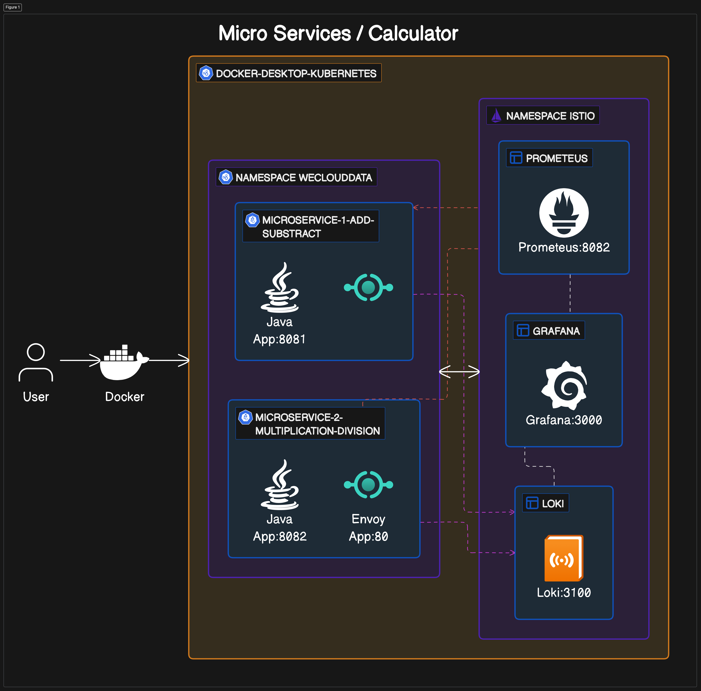

# Project 8 - Observability Systems

## Architecture

This project involves team collaboration to deploy a web application onto a cloud-based Kubernetes cluster. The deployment includes an active monitoring setup using observability systems. Students have a choice among several observability technologies, including Fluentd, Prometheus, Grafana, ELK (Elasticsearch, Logstash, Kibana), EFK (Elasticsearch, Fluentd/Fluent bit, Kibana), and Loki/Prometheus/Grafana configurations.

## Requirements

- **Web App**: Create or use an existing web app.
- **Dockerization**: Dockerize the app with a Dockerfile.
- **DockerHub Account**: Ensure you have a DockerHub account.
- **Docker Images**: Build Docker images in x86_64 and arm64 formats and push them to DockerHub.
- **Deployment**: Deploy the app on a Kubernetes cluster (e.g., AWS EKS, Local).
- **Observability Systems**:
  - **Loki**: Set up Loki to scrape logs.
  - **Prometheus**: Set up Prometheus to scrape metrics and store it.
  - **Grafana**: Use Grafana to visualize metrics from Prometheus and Loki.

## Solution

### Architecture Components:

- **User**: The user interacts with the system via Docker.
- **Docker**: Serves as the entry point for the user, managing containerized applications.
- **Kubernetes Namespace `weclouddata`**:
  - **Microservice-1 (Add-Subtract)**: A Java application running on port 8081.
  - **Microservice-2 (Multiplication-Division)**: A Java application with Envoy proxy running on port 8082.

- **Kubernetes Namespace `istio`**:
  - **Prometheus**: Monitoring system with a time-series database, accessible on port 8082.
  - **Grafana**: Analytics and monitoring platform visualizing data, accessible on port 3000.
  - **Loki**: Log aggregation system, accessible on port 3100.

#### Summary
 - Each service is encapsulated within its own container and is part of a microservice architecture that facilitates scalability and ease of maintenance. The observability of the system is managed through Prometheus, Grafana, and Loki, allowing for efficient monitoring and analysis.

> [!CAUTION]
> You should use this scripts in production environment, you must read each script and try to have a deep understanding about these scripts. The permissions and AWS policies, GitHub Credentials, and Docker Hub are temporals.  

> [!NOTE]
> You should have Terraform in your PATH environment.

> [!NOTE]
>	You should work always in /tmp.
> You should have kubectl in your path
> You should have Python in your path with the versions between ( 3.10 and 3.12)

> [!NOTE]
>	All the commands must be run as ubuntu user or any local user ( default user) .

> [!NOTE]
> You should try to understand each folder in Project-8---Observability-Systems/ (https://github.com/maxiplux/Project-8---Observability-Systems).
## Instalation.
- Setup your local docker-desktop with Kubernetes.

# Istio Installation Guide
## Prerequisites

- A Kubernetes cluster with versions: 1.26, 1.27, 1.28, or 1.29.
- `kubectl` installed and configured to access your cluster.

### Download Istio

Download the latest release of Istio with the following command:
- cd /tmp
- curl -L https://istio.io/downloadIstio | sh -
- cd istio-1.21.0
- export PATH=$PWD/bin:$PATH
- istioctl install --set profile=demo -y

### Install project
- cd /tmp
- git clone https://github.com/maxiplux/Project-8---Observability-Systems.git
- cd Project-8---Observability-Systems
- chmod +x *.sh

- sh monitoring.sh
- kubectl apply -f namespace.yml 
- kubectl label namespace weclouddata istio-injection=enabled
- 
 
- sh deployer.sh
- 
- kubectl get svc -n weclouddata | grep math-add-subtract
- 
- kubectl get svc -n weclouddata | grep math-division-multiplication
- 
###
- As you can see, we have two micro services running in our cluster under namespace weclouddata. We need to generate trafic to them.
- To achive that, we need to target by http the ports 31181 and 31979. Those ports are going to be the arguments to test our  micro services.
- These ports are relative to your machine, therefore  math-add-subtract=31979 and math-division-multiplication 31181. Thanks to it you can call the strees tool below. 
- ulimit -S -n 15000
- sh monitoring.sh
- python3 tester.py  math-add-subtract=31979 math-division-multiplication=31181
- 
- Now we can see the results about it
### Results
- istioctl dashboard kiali
- 
- In this context we are focus only in the services math-division-multiplication and math-add-subtract. 
### Graphana/Loki ( Now we are see in action all the trafic thanks to Graphana)
- kubectl port-forward svc/grafana 3000:3000 -n istio-system
- Go to Graphana -> Datasources -> Loki -> Label Filters = math-add-subtract or math-division-multiplication.
- 
### Graphana/Prometheus
- Import Spring Dashboard. 
- Graphana -> Home -> Dashboards-> Import Dashboard into Folder Istio using Datasource Prometheus
- Upload the file in the folder /graphana-dashboard/spring-boot-dashboard.json
- 
- 
- 
### Unistall components
- kubectl delete namespace istio-system
- kubectl delete namespace weclouddata
- istioctl uninstall -y --purge

